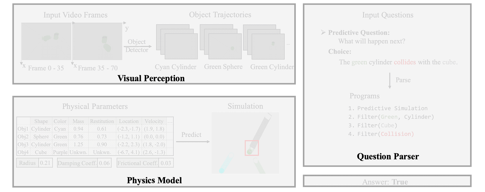

# VRDP (NeurIPS 2021)

**Dynamic Visual Reasoning by Learning Differentiable Physics Models from Video and Language**
<br>
[Mingyu Ding](https://dingmyu.github.io/),
[Zhenfang Chen](https://zfchenunique.github.io/),
[Tao Du](https://people.csail.mit.edu/taodu/),
[Ping Luo](http://luoping.me/),
[Joshua B. Tenenbaum](https://web.mit.edu/cocosci/josh.html), and
[Chuang Gan](http://people.csail.mit.edu/ganchuang/)
<br>



More details can be found at the [Project Page](http://vrdp.csail.mit.edu/).

If you find our work useful in your research please consider citing our paper:

    @inproceedings{ding2021dynamic,
      author = {Ding, Mingyu and Chen, Zhenfang and Du, Tao and Luo, Ping and Tenenbaum, Joshua B and Gan, Chuang},
      title = {Dynamic Visual Reasoning by Learning Differentiable Physics Models from Video and Language},
      booktitle = {Advances In Neural Information Processing Systems},
      year = {2021}
    }

## Prerequisites

- Python 3
- PyTorch 1.3 or higher
- All relative packages are covered by Miniconda
- Both CPUs and GPUs are supported

## Dataset preparation

- Download videos, video annotation,  questions and answers, and object proposals accordingly from the [official website](http://clevrer.csail.mit.edu/#)

- Transform videos into ".png" frames with ffmpeg.

- Organize the data as shown below.

  ```
  clevrer
  ├── annotation_00000-01000
  │   ├── annotation_00000.json
  │   ├── annotation_00001.json
  │   └── ...
  ├── ...
  ├── image_00000-01000
  │   │   ├── 1.png
  │   │   ├── 2.png
  │   │   └── ...
  │   └── ...
  ├── ...
  ├── questions
  │   ├── train.json
  │   ├── validation.json
  │   └── test.json
  ├── proposals
  │   ├── proposal_00000.json
  │   ├── proposal_00001.json
  │   └── ...
  ```

- We also provide data for physics learning and program execution in [Google Drive](https://drive.google.com/drive/folders/1vWnZoQYTxpvvwigxj_qnMYNyuHMjFF6Z?usp=sharing).
  You can download them optionally and put them in the `./data/` folder.

- Download the processed data [executor_data.zip](https://drive.google.com/file/d/1S_r9g6hgtrYZfRCc4Eh694545U_QHhqL/view?usp=sharing) for the executor. Put it in and unzip it to `./executor/data/`.

## Get Object Dictionaries (Concepts and Trajectories)

Download the [object proposals](http://clevrer.csail.mit.edu/#) from the region proposal network and follow the `Step-by-step Training` in [DCL](https://github.com/zfchenUnique/DCL-Release) to get object concepts and trajectories.

The above process includes:

- trajectory extraction
- concept learning
- trajectory refinement

Or you can download our extracted object dictionaries [object_dicts.zip](https://drive.google.com/file/d/1atGx3Xu2_DZvvlFTlX6ahm7Z14-g3tBX/view?usp=sharing) directly from Google Drive.

## Learning

### 1. Differentiable Physics Learning

After we get the above object dictionaries, we learn physical parameters from object properties and trajectories.

```shell
cd dynamics/
python3 learn_dynamics.py 10000 15000
# Here argv[1] and argv[2] represent the start and end processing index respectively.
```

The output object physical parameters [object_dicts_with_physics.zip](https://drive.google.com/file/d/1H41hTi_2_BOs4Vj6A5wu4eIzogfHh0C1/view?usp=sharing) can be downloaded from Google Drive.

### 2. Physics Simulation (counterfactual)

Physical simulation using learned physical parameters.

```shell
cd dynamics/
python3 physics_simulation.py 10000 15000
# Here argv[1] and argv[2] represent the start and end processing index respectively.
```

The output simulated trajectories/events [object_simulated.zip](https://drive.google.com/file/d/12BR4dfg3qo8F9N8rjfwP6Z4n0b4v6cQB/view?usp=sharing) can be downloaded from Google Drive.

### 3. Physics Simulation (predictive)

Correction of long-range prediction according to video observations.

```shell
cd dynamics/
python3 refine_prediction.py 10000 15000
# Here argv[1] and argv[2] represent the start and end processing index respectively.
```

The output refined trajectories/events [object_updated_results.zip](https://drive.google.com/file/d/1kVEVtxMZIpaodb6R1oWw2FLyHCxH-vsr/view?usp=sharing)  can be downloaded from Google Drive.

## Evaluation

After we get the final trajectories/events, we perform the neuro-symbolic execution and evaluate the performance on the validation set.

```shell
cd executor/
python3 evaluation.py
```

The test json file for evaluation on [evalAI](https://eval.ai/web/challenges/challenge-page/667/overview) can be generated by

```shell
cd executor/
python3 get_results.py
```

## The Generalized Clerver Dataset (counterfactual_mass)

- Download [causal_mass.zip](https://drive.google.com/file/d/1MczFuBo8ymhm0_qiBDbsCVNn4tYNbdhf/view?usp=sharing) and [counterfactual_mass.zip](https://drive.google.com/file/d/1qLJ2aBMg-V9Lle9MWXYh0zWt0zmm2bu4/view?usp=sharing) from Google Drive.
- Generate counterfactual data on the collision event by `python3 counterfactual_mass/generate_data.py`

## Examples

- Predictive question
  
- Counterfactual question
  

## Acknowledgements

For questions regarding VRDP, feel free to post here or directly contact the author (mingyuding@hku.hk).